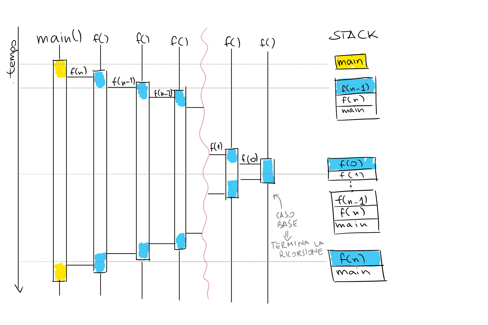

# Funzioni

> In un programma è sempre opportuno e conveniente strutturare il codice raggruppandone
> delle sue parti in **sotto-programmi autonomi**, detti **funzioni**, che vengono eseguite in ogni
> punto in cui è richiesto.

### Perché?
Le funzioni permettono di ridurre la duplicazione di codice, di raggruppare più operazioni per crearne una più complessa (es. ```stampa_array(v)```) e dunque di semplificare la scrittura e la lettura del codice da parte di altri (dove "altri" comprende anche voi il giorno dopo che lo avete scritto :wink:). Inoltre, molti problemi possono essere risolti con le funzioni ricorsive.
### Come?
Ogni funzione è composta di 4 elementi:
* __Nome__: sequenza di caratteri che identifica la funzione e permette di usarla
* __Lista di parametri__: insieme di variabili locali che possono essere utilizzate nel corpo della funzione
* __Valore di ritorno__: quando la funzione ritorna il controllo al punto del codice in cui è stata chiama, può ritornare un valore, che può essere usato come un qualunque altro r-value.

   > con __r-value__ si intendono tutte le espressioni che possono stare a _destra_ di un assegnamento, ad esempio in `x = 1;`, `1` è l'_r-value_, mentre `x` è un __l-value__, ovvero un'espressione che può stare a sinistra dell'operatore `=`, e che fa da "contenitore" di r-value. As a rule of thumb, le variabili e le _dereference_ (`\*p`) di puntatori sono _l-value_, mentre le espressioni aritmetiche e i valori di ritorno sono _r-value_.
   Se il tipi di ritorno è `void` si parla di __procedura__ (anziché di funzione), l'unica differenza è che lo statement di return in questo caso non è richiesto (si può però utilizzare per restituire "prematuramente" il controllo al chiamante).
* __Corpo/codice__: Qui si scrive il codice vero e proprio, "quello che la funzione deve fare quando viene invocata".

#### Dichiarazione e definizione
I primi 3 dei 4 elementi sopra descritti compongono la __firma__ di una funzione. Questa può essere usata per _dichiarare_ l'esistenza della funzione in un punto del programma diverso (un diverso file o nello stesso file ma in una posizione precedente) da quello in cui la funzione è effettivamente _definita_, ovvero dove sono scritte sia la sua firma che il codice.
Per dichiarare e dunque poter usare la funzione è sufficiente scrivere:
```cpp
tipo_di_ritorno nome_della_funzione(tipo_parametro1 nome_parametro1, tipo2 nome2, ...);
```
Da questo punto, nel codice del nostro programma, noi potremo usare questa funzione come se fosse contenuta in una delle librerie che usiamo normalmente (es. `max(a,b)`in `cmath`).
Ovviamente dovremo da qualche parte scrivere anche quello che la funzione fa, inserendo questo codice ad esempio sotto la funzione `main()` del nostro programma:
```cpp
tipo_di_ritorno nome_della_funzione(tipo_parametro1 nome_parametro1, tipo2 nome2, ...) {
    tipo_di_ritono res;
    // Operazioni varie che usano i parametri e assegnano un valore a res
    return res;
}
```
Si può evitare di dichiarare la funzione scrivendo la definizione della funzione direttamente prima della parte di codice in cui dobbiamo usarla (es. in `main()`), tuttavia, man mano che il codice diventa più strutturato potrebbe essere più conveniente avere la funzione principale (`main()`) più "in vista" rispetto a quelle ausiliarie.

#### In memoria
Nella memoria del computer la memoria riservata a ciascuna funzione è allocata secondo una struttura a __stack__ o __pila__, in cui si può accedere ogni volta solo all'elemento inserito più di recente. Questo significa, in termini di funzioni, che il controllo del programma appartiene sempre e solo alla funzione che è stata chiamata per ultima, ovvero quella che sta in cima alla pila.


Dentro la memoria riservata a ciascuna chiamata di funzione vi è allocato lo spazio per i parametri della chiamata, il valore di ritorno e tutte le altre variabili locali eventualmente dichiarate nel corpo della funzione. Questo significa che eventuali variabili con lo stesso nome di altre dichiarate all'esterno della funzione vengono mascherate da quelle "più interne" (si parla di _scoping delle variabili_).

#### Passaggio di parametri
Ci sono 4 modi in cui una funzione può prendere i propri parametri quando viene chiamata:
* __Per valore__: il parametro deve essere un _r-value_, e questo viene copiato direttamente nella variabile in posizione corrispondente nella firma della funzione. Se la variabile viene modificata all'interno del corpo della funzione questi cambiamenti non si riflettono in alcun modo nel codice del chiamante.

  Ad esempio:
  ```cpp
    int sottrazione(int a, int b) {
      a -= b;
      return a;
    }
    int main() {
      int a = 5;
      int b = 8;
      int sott = sottrazione(a,b);
      cout << "a = " << a << endl;
      cout << "b = " << b << endl;
      cout << "a - b = " << sott << endl;
    }
    
    // Questo programma stampa
    // a = 5
    // b = 8
    // a - b = -3
    // Ovvero il valore di a non è cambiato dopo la chiamata a sottrazione(a,b), perché il valore dei parametri della chiamata
    // è stato copiato nelle variabili locali della funzione
  ```
* __Per riferimento__: anziché passare un valore si passa un _indirizzo_ (_l-value_), le modifiche alle variabili che avvengono nella funzione chiamata si riflettono anche nel chiamante.
  Esempio:
  ```cpp
    void pikachu(int &x, int y) {
      a -= b;
      b++;
    }
    
    int main() {
      int a = 5;
      int b = 2;
      // operatore & : indirizzo di a
      // 2*b è un r-value
      pikachu(&a,2*b);
      cout << "a = " << a << endl;
      cout << "b = " << b << endl;
    }
    
    // Questo programma stampa
    // a = 1
    // b = 2
    // Ovvero il valore di a in main è lo stesso che x ha alla fine dell'esecuzione della funzione
    // b è invariato, perché viene passato 2*b per valore alla funzione
  ```
  Il passaggio per riferimento può essere molto utile per risparmiare memoria nel caso in cui si debba passare alla funzione un parametro molto "ingombrante" (vedi: modello a stack). __Attenzione ad eventuali modifiche!__ Per accertarsi di non modificare per sbaglio una variabile passata per riferimento si può usare il __passaggio per riferimento costante__ (`void f(const int &a)` darà un errore se cercate di modificare a nel corpo della funzione)
* __Passaggio per puntatore__: si passa alla funzione un puntatore ad un oggetto e all'interno della funzione vi si accede tramite l'operatore di _dereference_ (`*`). Poco interessante per le nostre applicazioni: meglio evitare di incasinarsi con i puntatori :speak_no_evil:

In ogni caso, quando programmate per le Olimpiadi, potete evitare di passare alcuni parametri che non devono essere unici per ogni chiamata, potete semplificare le firme dichiarando queste variabili come variabili globali.

# Funzioni ricorsive
> Funzione che chiama se stessa
> * Due componenti:
>     * una o più condizioni di terminazione
>     * una o più chiamate ricorsive

### Perché?
Alcuni problemi e strutture dati hanno una definizione intrinsecamente ricorsiva, ad esempio tutti i problemi definiti per [induzione](https://it.wikipedia.org/wiki/Principio_d%27induzione). Sapere come tradurre la soluzione questi problemi in una funzione ricorsiva può quindi permetterci di avere in tempi brevi una soluzione che risolve almeno le istanze più semplici del problema.
La maggior parte delle soluzioni ricorsive prevedono l'uso di una tecnica detta __*backtracking*__, la quale prevede di provare tutte le scelte e/o combinazioni possibili fino a trovare quella giusta (o di costo minore/guadagno maggiore, per i problemi di ottimizzazione).

### Come?
Per scrivere una funzione ricorsiva è sufficiente scrivere una funzione come descritto sopra, e fare in modo che questa abbia le due componenti della definizione:
* una o più chiamate a se stessa: avviene come ogni altra chiamata (`funzione(parametri)`)
* una o più condizioni di terminazione: dobbiamo evitare la ricorsione infinita (simile ai loop infiniti), e per farlo imponiamo un limite al numero di chiamate che possono essere attive contemporaneamente (il numero di chiamate in genere dipende da uno dei parametri in input del problema)

#### Esempio: fattoriale
```cpp
   long long f(int n) {
      if (n == 0) {
         return 1;
      } else {
         long long res = f(n-1);
         return res * n;
      }
   }
```

#### Esempio: Fibonacci
```cpp
int fibonacci(int n) {
  if (n==0) {
    return 0;
  } else if (n == 1) {
    return 1;
  } else {
    return fibonacci(n-1) + fibonacci(n-2);
  }
}
```


## Backtrack e il problema della scelta
> Il __*Backtracking*__ è una tecnica di programmazione che prevede di provare tutte le possibili soluzioni e di selezionare quelle ammissibili (problemi di decisione/è richiesto di trovare una soluzione qualsiasi) oppure quelle migliori (problemi di ottimizzazione).

Questa tecnica è fortemente legata alla ricorsione, in quanto la struttura delle chiamate ricorsive ci permette di tenere traccia della "storia" delle scelte che abbiamo effettuato, per tornare indietro e provare ad effettuarne una diversa.

### Perché?
Il backtrack viene usato quando si deve esploare tutto lo spazio delle soluzioni di un problema (es. stampare _tutte_ le permutazioni di un array) oppure quando il problema da dei vincoli sull'input sufficientemente piccoli da permettere di provare tutte gli stati possibili del problema e selezionare quello migliore. In generale tutti i problemi si possono risolvere con backtracking (es. ordinamento provando tutte le possibili permutazioni dell'array), spesso tuttavia il tempo impiegato da questi algoritmi per trovare la soluzione non è accettabile.

### Come?
Consideriamo il problema [Piastrelle](https://training.olinfo.it/#/task/piastrelle/statement). Chiaramente in questo caso dobbiamo controllare tutte le possibili piastrellature per poterle stampare; inoltre N è al più 25, sufficientemente piccolo per una soluzione ricorsiva.
Abbiamo un corridoio di lunghezza N, da ricoprire con piastrelle di lunghezza 1 e 2. Possiamo pensare di dividere il corridoio in N slot di grandezza 1, inizialmente tutti liberi; una piastrella piccola occupa uno slot, una grande ne copre due.
Partiamo da un estremo del corridoio. Cosa possiamo fare?
* Inserire una piastrella piccola, rimarranno N-1 slot
* Inserire una piastrella grande, rimarranno N-2 slot

   _**Quale decisione prendere?**_ Entrambe le scelte sono valide (purché N > 1): le proviamo entrambe. Questo significa provare prima a     piastrellare un corridoio di N-1 slot liberi (è dunque la stessa operazione di riempire N slot, è cambiato solo il parametro), poi a piastrellare un corridoio lungo N-2. Possiamo ripetere questa operazione finché abbiamo slot disponibili.
   _**Una volta finiti gli slot liberi, cosa succede?**_ Se non abbiamo più posto per inserire le piastrelle, significa che possiamo stampare questa configurazione come una delle soluzioni ammissibili.
   _**Come fare a sapere quale sia la configurazione ammissibile?**_ Dobbiamo, ogni volta che decidiamo di usare un tipo di piastrella, salvare questa scelta in un vettore (**vettore delle scelte**), in modo tale che, una volta effettuate tutte le scelte, abbiamo una traccia su quelle precedenti. Usiamo una variabile che tenga conto di quante piastrelle abbiamo usato nella configurazione corrente.

```cpp
int choices[25];

void piastrella(int n, int c) {
    if (n == 0) {
        for (int i=0; i < c; i++) {
            if (choices[i] == 1) {
                out << "[O]";
            } else {
                out << "[OOOO]";
            }
        }
        out << endl;
    } else if (n > 0) {
        choices[c] = 1;
        piastrella(n-1,c+1);
        choices[c] = 2;
        piastrella(n-2,c+1);
    }
}
```cpp
